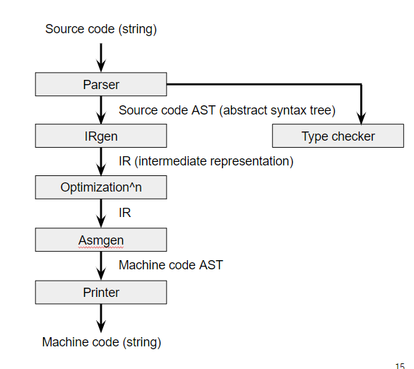
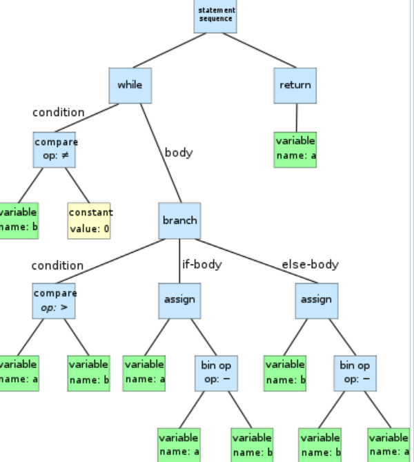

# Organization of Compiler



## parser

translate source code from string to AST



## type checker

strong type safety : if type checked, program doesn't go wrong

## IR Generation

IR : Source language나 Target language와 다르게 optimization friendly

### LLVM IR의 특징
- control-flow graph
- register guarantees non-interferences
- no ambiguous var names
  - static scoping vs dynamic scoping : static이 더 대중적
- explicitly annotated types
- SSA

### Translation to IR

변수들을 레지스터로 바꿀 때 ***symbol table*** 이 필요
> symbol table : {}에서 시작할 때 스택 형식으로 layer 추가, 닫힐 때 layer 제거

### SSA

register is defined at most once in code

반드시 register의 redefine이 필요한 경우 존재(for loop)
- phinode register 사용
- block으로 jump 할 때 argument로 phinode의 초기값 받음
- KECC phinode 표기 : ```%b7:p0``` , ```%b7:p1```
- 

## Optimization

## Assembly Generation

