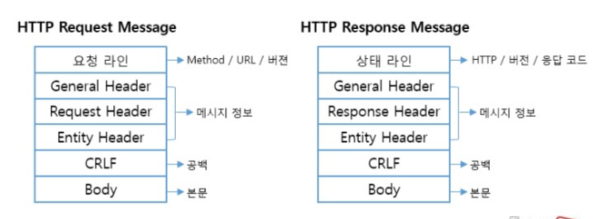
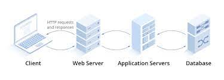
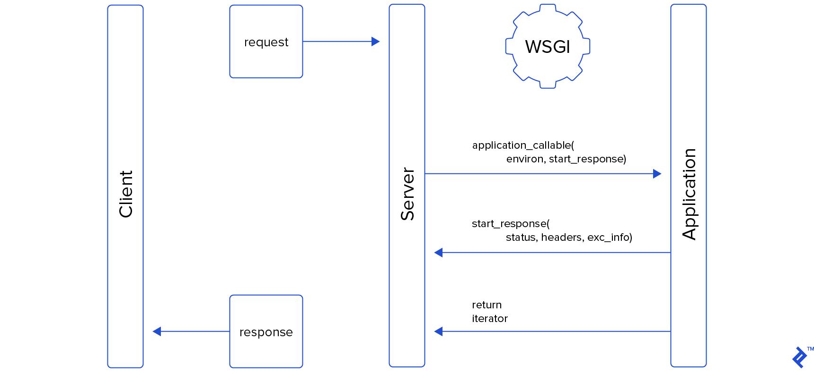

# Background of Django

## 1. HTTP 메시지 구조

클라이언트에서 서버로 보내는 요청 / 서버에서 클라이언트로 응답 2가지 종류

헤더, 바디는 생략 가능

헤더는 이름: 값 형식

가장 자주쓰이는 메소드는 GET, POST(html의 `<form>` 에서 서버로 호출할 수 있는 메소드이기도 함)

## 2. URL 설계와 RPC vs REST

### URL 구조

URL scheme `://` 호스트명 : 포트번호 / 경로 ? 쿼리스트링({키=값}) # fragment

### RPC(Remote Procedural Call)

 - 클라이언트가 네트워크의 서버가 제공하는 API를 호출하는 방식(URL 호출이 곧 API)

 - URL 경로가 대부분 동사 (/search?name=test)

### REST

 - 웹 서버의 모든 요소가 리소스라 가정하고, URL을 통해 리소스를 표현하는 개념

 - 이 때 리소스의 조작을 GET, POST, PUT, DELETE 등의 HTTP 메소드로 함

 - URL 경로의 대부분이 명사 (/search/test)

### 간편 URL

 - 쿼리스트링 없이 경로만 가진 간단한 구조의 URL

 - 파이썬에서 간편 URL에 정의에 정규표현식 기능을 추가한 것을 Elegant URL (우아한 URL)이라 부름

## 3. 웹 애플리케이션 서버

 - html 코드가 자동으로 생성되는 동적 페이지에 대한 요구가 증가

 - 정적 페이지만을 처리하는 `웹 서버`와 웹 서버로부터 동적 페이지 요청을 받아서 이를 처리하고 웹 서버로 반환하는 `웹 애플리케이션`으로 분화됨

### 역사

 - 예전에는 웹 서버만 존재하다가 동적 페이지에 대한 요구 증가로 동적 페이지마다 담당 프로세스를 만들고 프로세스와 웹 서버가 CGI 규격에서 통신하는 방법이 등장

   - 하지만 요청의 개수에 비례하여 프로세스 수가 증가하므로 오버헤드가 큼
 - 대안
   - 동적 페이지 요청을 처리하는 스크립트를 작성하고 웹 서버에 스크립트 인터프리터를 내장시키기
     - e.g. mod_wsgi
   - 동적 페이지 요청을 처리하는 프로세스를 데몬으로 미리 가동시키기
     - 웹 애플리케이션 서버로 발전함
     - e.g. JSP, ASP

웹 애플리케이션 서버가 사용되는 구조

웹 서버는 캐시 기능, 프록시 기능도 수행

효율적 하드웨어 증설을 위해 웹 서버와 웹 애플리케이션 서버의 메모리 사용량을 비교해보거나 로드 밸런스용 스위치의 도입을 고려해볼 수 있을 것이다.

## 4. 파이썬 기본 라이브러리들 (웹 개발용)

 - Web Client : `urllib` , `http.client`, `http.cookiejar`
 - Web Server : `Django`, `Flask`, `http.cookie`, `http.server`

 - WSGI : 웹 서버와 웹 애플리케이션 간의 연동 규격
   - WSGI 규격에 맞춰서 동적 페이지 관련 스크립트(python)을 짜면 wsgi 서버인 mod_wsgi에 의해 어떤 웹 서버에서도 이 애플리케이션이 실행될 수 있는 것

## References

파이썬 웹 프로그래밍(김석훈, 2021)

https://velog.io/@sdc337dc/%EC%9B%B9-%EA%B0%9C%EB%85%90-Http-%ED%86%B5%EC%8B%A0
