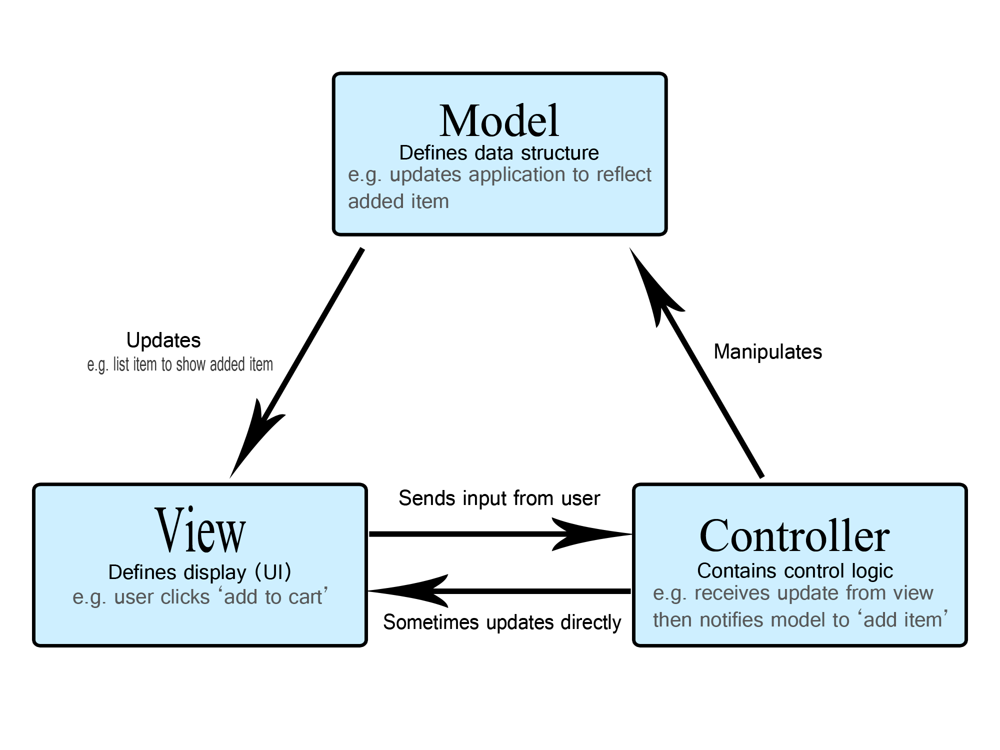
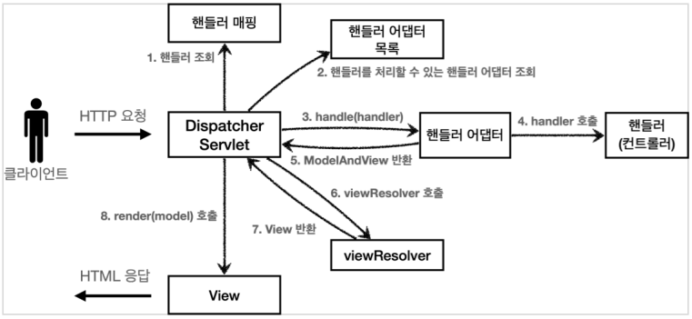

# Overview of software stacks

## CI/CD pipeline

Continuous Integration/Continuous Delivery 의 약자이다  
말 그대로 더 지속적인 서비스 제공, 배포를 위해 애플리케이션 개발을 자동화하는 것이 목적

CI : 여러명의 개발자가 코드를 수정할 때 충돌 줄이고 빠르게 통합
CD : 변경사항이 고객이 사용할 수 있는 프로덕션 환경까지 릴리스 되는 과정을 가속화

### 대표적인 툴 :
- Jenkins 자동화 서버

## kotlin

JVM 기반 언어로 java보다 간결하고 널 안전성 제공, 예외처리 생략 등의 장점 가짐

- **사용** : 안드로이드, 스프링 프레임워크, 톰캣, js, java EE, Html5, iOS, 라즈베리 파이 개발

## Gradle

그루비(Grrovy)를 기반으로 한 make같은 빌드 자동화 시스템

### 장점

- 직관적인 코드와 자동완성
- 다양한 repo 사용 가능
- 각 작업에 필요한 라이브러리만 가져올 수 있음 (testImplementation, debugImplementation ..)
- 빠른 빌드
  - 점진적 빌드
  - 빌드 캐시로 같은 파일을 두 번 빌드 안함
  - Daemon Process로 메모리에 빌드 결과 보관

## Netty

비동기 이벤트 기반 네트워크 애플리케이션 프레임워크

## Spring Framework

자바 플랫폼을 위한 오픈 소스 애플리케이션 프레임워크로, 동적 웹 사이트 개발을 위한 여러 서비스를 제공한다.

### 특징

- 경량 컨테이너로서 자바 객체를 직접 관리
- POJO 방식으로 J2EE와 다르게 인터페이스를 구현하거나 상속을 받을 필요가 없고 객체가 가볍다
  - POJO : plain old java object, 외부 라이브러리 의존 없이 순수한 java만 사용
- 제어 반전(IoC), 의존성 주입(DI), 관점지향 프로그래밍(AOP)을 지원한다
- 확장성이 높다

### 주요 모듈

- IoC 컨테이너 : 객체의 생명주기 관리, 의존성 주입
- 관점 지향 프로그래밍 프레임워크
- 데이터 엑세스 프레임워크 (JDBC, 하이버네이트 등에 대한 지원)
- 트랜잭션 관리 프레임워크
- MVC 패턴
- 배치 프레임워크
- 스프링 부트

### MVC 
Model-View-Controller 의 약자로 소프트웨어의 비즈니스 로직과 화면을 구분하는 디자인 패턴
MVVM, MVP, MVW 등의 바리에이션 존재

#### 컴포넌트

- 컨트롤러 : 모델과 뷰 제어, 업데이트 모니터링
- 모델 : 데이터 구조와 비즈니스 로직 관리, 다른 컴포넌트의 내부를 알 수 없음
- 뷰 : 레이아웃과 화면 처리, 다른 컴포넌트의 내부를 알 수 없음
  - 모델의 정보를 따로 저장해서도 안된다
  

#### Model 1과 Model 2가 존재, Spring에서는 Model 2를 채택

## References

https://www.codestates.com/blog/content/%EC%8A%A4%ED%94%84%EB%A7%81-%EC%8A%A4%ED%94%84%EB%A7%81%EB%B6%80%ED%8A%B8
https://developer.mozilla.org/ko/docs/Glossary/MVC
https://ittrue.tistory.com/234
https://www.linkedin.com/pulse/istio%EB%8A%94-%EB%AC%B4%EC%97%87%EC%9D%B4%EA%B3%A0-%EC%99%9C-%EC%A4%91%EC%9A%94%ED%95%A0%EA%B9%8C-sean-lee/?originalSubdomain=kr
