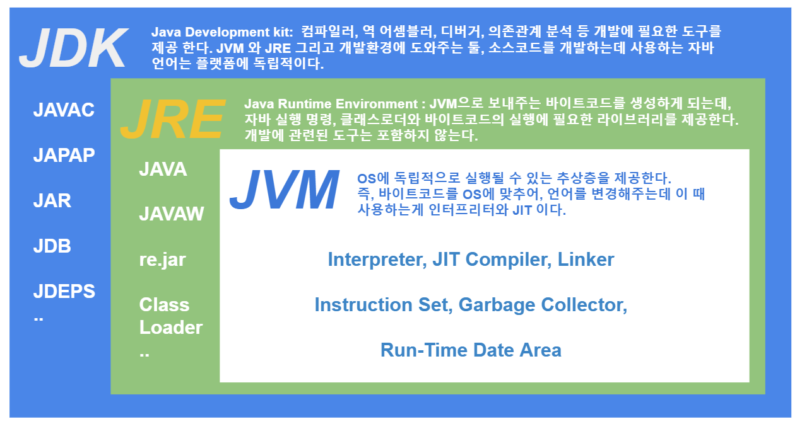
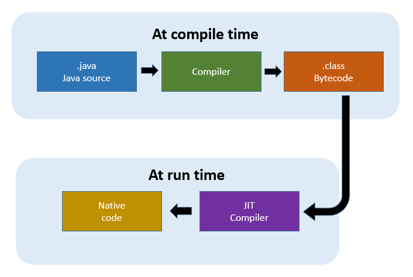

# Compilation Process of Java




## Remarks

- JVM의 목적 : cross compilation
- Runtime에서는 Interpreter와 JIT 컴파일러가 동작
- 자주 실행되는 바이트코드를 JIT 컴파일러로 저장소에 기계어로 저장
- 제한된 리소스의 클라이언트를 위한 C1 컴파일러와 서버용 C2 컴파일러, 혼합된 형태의 Tiered compilation이 존재

### JIT 동작 과정
  1. 바이트코드를 기계어에 더 가까운 ```trees``` 형태로 변환
  2. *inlining* :자주쓰이는 코드의 tree를 caller에 merge
  3. local optimization : classic 정적 컴파일러의 local 최적화
  4. control flow opt, global opt
  5. native code generation

## Reference

https://catch-me-java.tistory.com/11

https://aboullaite.me/understanding-jit-compiler-just-in-time-compiler/