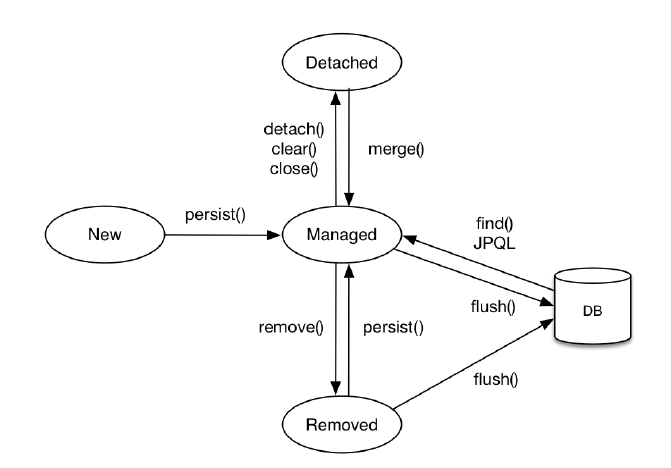

# Importing MariaDB

## 1. Background

### ORM
Object Relational Mapping의 줄임말로 객체와 테이블을 자동으로 매핑해주는 역할

객체와 테이블 사이의 불일치를 해결

- 장점
  - 쿼리를 객체지향적으로 조작이 가능
  - 재사용 및 유지보수가 편리
  - 데이터베이스에 대한 종속성이 줄어듦
- 단점
  - ORM만으로 온전한 서비스를 구현하기에는 한계가 존재
  - 객체 관점과 RDB(Relational DB) 관점의 불일치를 완전히 해소하지는 못함
    - 상속성, 세분성, 식별성, 연관성, 탐색에서 차이가 있다

### JPA
자바 진영의 ORM 기술 표준으로 채택된 인터페이스들의 모음이다.  
ORM, JPA 모두 명세이고 실제 구현체로는 Hibernate, DataNucleus 등이 있다.  
JPA는 개발자 대신 적절한 SQL을 생성하고 데이터베이스를 조작해서 객체를 자동매핑하는 역할을 수행한다.

### Spring JPA
스프링 하위 프로젝트 중 하나로 하이버네이트의 EntityManager를 직접 다루지 않고 Repository를 정의해 사용함으로써 스프링이 적합한 쿼리를 동적으로 생성하는 방식으로 DB를 조작한다.  

### 영속성 컨텍스트
영속성 컨텍스트(Persistence Context)는 애플리케이션의 엔티티와 DB의 레코드 사이 괴리를 해소하고 객체를 보관한다. 캐시로서의 기능도 존재한다.

- 각 엔티티는 New, Detached, Managed, Removed 의 상태로 구분됨
- 엔티니 매니저는 데이터베이스에 접근해서 CRUD를 수행  
- Spring Data JPA를 사용하면 Repository를 이용해서 DB에 접근하는데, 이 때 엔티티매니저를 사용하는 코드를 볼 수 있음  
- 엔티티 매니저는 엔티티 팩토리가 만드며, 스프링에서는 자동 설정이 있지만 Hibernate에서는 persistence.xml의 설정이 필요하다.

## 2. install

생략. MariaDB를 설치하면 HeidiSQL이 같이 설치됨

## 3. Spring Initilizr

원래대로 Develeoper Tools의 Lombok, Spring Configuration Processor, `Web`의 Spring Web MVC를 선택하고 추가로 `SQL`의 Spring Data JPA와 MariaDB Driver를 선택

## 4. HeidiSQL

HeidiSQL에서 세션을 새로 만들고 (mariadb 설치 시 설정한 root 정보 이용) 새로 데이터베이스를 생성한다. 쿼리 탭에서 `create database springboot;`을 입력 후 실행해주면 된다.

## 5. application.properties
application.properties 파일에 DB관련 설정을 추가해준다.
```properties
spring.datasource.driver-class-name=org.mariadb.jdbc.Driver
spring.datasource.url=jdbc:mariadb://localhost:3306/spring_schema
spring.datasource.username=root
spring.datasource.password=root0869

spring.jpa.hibernate.ddl-auto=create
spring.jpa.show-sql=true
spring.jpa.properties.hibernate.format_sql=true
```

ddl-auto로 가능한 값은 다음과 같다.
 - create : 앱 가동 후 SessionFactory가 실행될 때 기존 테이블을 지우고 새로 생성
 - create-drop : create처럼 첫 실행 때 초기화 후 앱 종료 시 테이블을 지움
 - update : SessionFactory가 실행될 때 객체를 검사해서 스키마를 갱신, 기존 데이터는 유지
 - validate : update처럼 객체를 검사하지만 스키마는 그대로 둔다. 테이블과 객체의 정보가 다르면 에러 발생
 - none : ddl-auto 기능을 사용하지 않는다

보통 개발 시에는 create, create-drop, update를, 운영 시에는 none이나 validate를 사용한다.

## 6. Entity 등록

Entity로 사용할 객체(ex: Product)를 다음과 같이 선언해준다.
```java
@Entity
@Getter
@Setter
@AllArgsConstructor
@NoArgsConstructor
@Table(name = "product")
public class Product {
    @Id
    @GeneratedValue(strategy = GenerationType.IDENTITY)
    private Long number;

    @Column(nullable = false)
    private String name;

    @Column(nullable = false)
    private Integer price;

    @Column(nullable = false)
    private Integer stock;
}
```

- @Entity : 해당 클래스가 엔티티임을 명시, 클래스가 테이블, 인스턴스가 레코드에 매핑됨
- @Table : @Entity가 있으면 테이블 이름이 클래스 이름과 같게 선언되는데, 다르게 하고싶을 때 이 어노테이션을 사용하면 된다.
- @Id : 해당 필드가 Primary key
- @GeneratedValue : 일반적으로 @Id와 같이 사용되며, 해당 필드의 값이 자동으로 생성됨을 의미. 생성 방식으로는 AUTO, IDENTITY, SEQUENCE 등이 있다. 
- @Column : 필드가 칼럼으로 매핑됨을 의미, 기본적으로 모든 필드가 칼럼으로 매핑되므로 생략해도 됨
- @Transient : 엔티티의 필드지만 테이블에 필요 없을 때 사용

## 7. 리포지토리 인터페이스 설계

data.repository 패키지에 아래와 같이 리포지토리 생성
```java
public interface ProductRepository extends JpaRepository<Product,Long> {
}
```

이 리포지토리 인터페이스는 Spring Data JPA에 의해 제공됨.  

## 8. DAO 설계
DAO(Data Access Object)는 데이터베이스에 접근하는 로직을 관리한다. 서비스 레이어에서 직접 데이터베이스에 접근하는 코드를 짜는 것보다 유지보수 측면에서 유리

아래는 인터페이스-구현체 패턴으로 구현한 예제의 일부이다.

```java
public interface ProductDAO {
    Product insertProduct(Product product);
    Product selectProduct(Long number);
    Product updateProductName(Long number, String name) throws Exception;
    void deleteProduct(Long number) throws Exception;
}

```

```java
@Component
public class ProductDAOImpl implements ProductDAO {

    private final ProductRepository productRepository;

    @Autowired
    public ProductDAOImpl(ProductRepository productRepository){
        this.productRepository=productRepository;
    }
    @Override
    public Product insertProduct(Product product) {
        Product savedProduct = productRepository.save(product);
        return savedProduct;
    }

    @Override
    public Product selectProduct(Long number) {
        Product seleceProduct = productRepository.getReferenceById(number);
        return seleceProduct;
    }
    ...
}

```

이 예제에서 DAO의 함수는 서비스레이어로 리턴을 전달할 때 Entity객체를 그대로 리턴하고 있지만, 일반적으로는 DTO를 쓴다고 함.  
위 예제에서 @Component로 빈에 등록하고 @Autowired로 의존성을 주입받고 있다.

종합하면 예제에서 레이어의 구조는

`클라이언트 - 컨트롤러 - 서비스 - DAO | 레포지토리 - 데이터베이스` 가 된다.

중요한 점은 Entity에는 equals, canEqual, hashCode 메소드를 오버라이딩해야 표에서 비교가 이뤄질 수 있다. 이는 Lombok으로 자동 생성이 가능하다.

## 8. Lombok

어노테이션을 통해 Getter/Setter, 생성자 등 중복되는 코드를 대체할 수 있다.
@Getter, @Setter, @NoArgsConstructor, @AllArgsConstructor, @ToString,
@EqualsAndHashCode 등이 자주 쓰인다.

그러나 1.16버전 기준으로 어노테이션 생성 후에 필드의 순서를 바꾸거나 했을 때 자동생성된 메소드가 바뀔 때 리팩토링이 IDE와 잘 맞물리지 않는 등의 pitfall이 존재하므로 사용 시 유의가 필요하다.
https://kwonnam.pe.kr/wiki/java/lombok/pitfall 참고
위 블로그에 따르면 NoArgs와 AllArgs 사용을 자제하고 Builder 어노테이션을 쓰는 것이 낫다고 한다.
