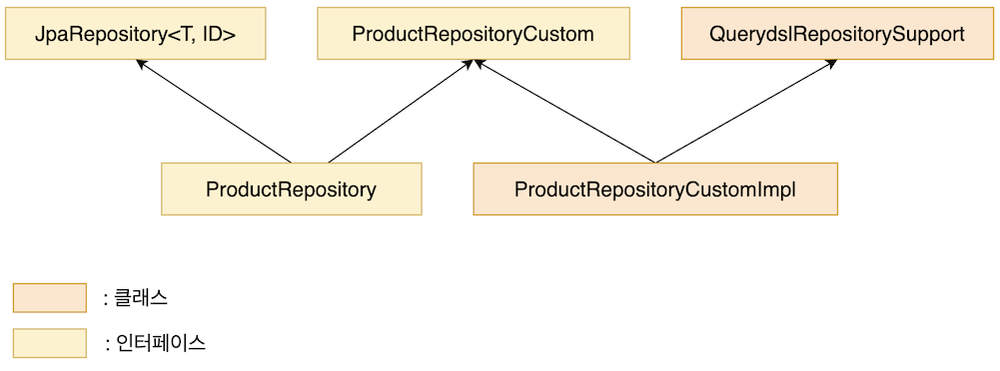

# Advanced Spring Data JPA

## 1. JPQL

JPA Query Language의 줄임말로 JPA에서 사용할 수 있는 쿼리를 의미  
SQL과 비슷하지만 쿼리에서 칼럼 대신 엔티티의 필드 이름을 사용  

```java
public interface ProductRepository extends JpaRepository<Product,Long> {
    List<Product> findProductByNameOrderByNumberDesc(String name);
    List<Product> findProductByName(String name);
}
```
쿼리는 크게 주제(Subject) 부분과 서술어(Predicate)로 구성되며, By가 서술어의 시작을 나타냄.

### 주제(Subject)

 - find...By
 - read...By
 - get...By
 - query...By
 - search...By
 - stream...By
 - exists...By
 - count...By
 - delete/remove...By
 - First[num]/Top[num] : ex) findFirst5ByName

### 조건자
서술어 부분에서 사용됨
 - Is : e.g. findByNumberIs(Long number)
 - (Is)Not, (Is)Null, (Is)NotNull, (Is)True, (Is)False
 - And, Or

### 정렬
  Order By (Asc/Desc)
- e.g. findByNameOrderByNumberAsc
- 정렬기준이 여러개면 And 없이 우선순위대로 나열하면 됨
- findByNameOrdeByNumberAscPriceDesc
- Sort때문에 메소드 이름이 길어지면 매개변수로 받을 수도 있음
- findByName(String name, Sort sort)
- ```java
  findByName(name,Sort.by(Order.asc("number"),Order.desc("price")))
  ```
  
### 페이징
레코드를 개수로 나눠 여러 페이지에 담는 것
```java
Page<Product> findByName(String name,Pageable pageable);

Page<Product> productPage = productRepository.findByName(
    "pen", PageRequest.of(0,2)
);
... = productPage.getContent();
```
PageRequest는 Pageable의 구현체

```java
of(int page,int size)
```
page는 페이지 번호 (0부터 시작), size는 페이지 당 데이터 개수를 의미한다.

`getContent()` 로 배열 형태로 Page에서 실제 값을 가져올 수 있다.

## 2. @Query 어노테이션

어노테이션으로 직접 JPQL을 작성해서 메소드의 가독성을 높일 수 있다.

```java
@Query("SELECT p from Product p where p.name = :input")
List<Product> findByNameWithJPQL(@Param("input") String name);
```

또한 원하는 칼럼만 선택해서 추출할 수 있다는 장점도 있다.

```java
@Query("SELECT p.stock, p.price from Product p where p.name = :input")
List<Product> findByNameWithJPQL(@Param("input") String name);
```

## 3. QueryDSL

코드로 쿼리를 작성해서 SQL 실수를 줄여주는 프레임워크

장점
 - 코드 자동완성 기능 사용 가능
 - 문법적으로 맞는 쿼리만 작성 가능
 - 가독성, 생산성 향상

### Gradle 설정

```gradle
plugins {
//    id "com.ewerk.gradle.plugins.querydsl" version "1.0.10"
}

dependencies {
    implementation('com.querydsl:querydsl-jpa:5.0.0:jakarta')
    annotationProcessor('com.querydsl:querydsl-apt:5.0.0:jakarta')
    annotationProcessor('jakarta.annotation:jakarta.annotation-api')
    annotationProcessor('jakarta.persistence:jakarta.persistence-api')
}

def querydslDir = "$buildDir/generated/querydsl"

sourceSets {
    main.java.srcDirs += [ querydslDir ]
}

tasks.withType(JavaCompile) {
    options.annotationProcessorGeneratedSourcesDirectory = file(querydslDir)
}

clean.doLast {
    file(querydslDir).deleteDir()
}
```

### QueryDSL을 이용한 테스트 코드 예시

```java
@SpringBootTest
public class ProductRepositoryTest {
    @PersistenceContext
    EntityManager entityManager;

    @Test
    void queryDSLTest() {
        JPAQuery<Product> query = new JPAQuery(entityManager);
        QProduct qProduct = QProduct.product;

        List<Product> productList = query.from(qProduct)
                .where(qProduct.name.eq("pen"))
                .orderBy(qProduct.price.asc())
                .fetch();
        for(Product p : productList){
            System.out.println(p);
        }
    }
}
```
@PersistenceContext로 영속성 컨텍스트를 주입받고, 테스트 내에서 이를 이용해서 JPAQuery 객체를 만든다. 그 후 빌더 패턴으로 쿼리를 만들 수 있다.

빌더 패턴에서 맨 마지막에 사용할 수 있는 함수로는 fetch(), fetchOne(), fetchFirst(), fetchCount() 등이 있다.

```java
@Test
void queryDSLTest2() {
    JPAQueryFactory jpaQueryFactory = new JPAQueryFactory(entityManager);
    QProduct qProduct = QProduct.product;

    List<String> productList = jpaQueryFactory.select(qProduct.name).from(qProduct)
            .where(qProduct.name.eq("pen"))
            .orderBy(qProduct.price.asc())
            .fetch();
    for(String p : productList){
        System.out.println(p);
    }
}
```

위 예제처럼 JPAQueryFactory 패턴을 이용해서 쿼리를 작성할 수도 있다. 첫 예제에 대해 갖는 장점은 select를 사용해서 칼럼 별 projection이 가능하다는 것이다.

```java
@Autowired
JPAQueryFactory jpaQueryFactory;

@Test
void queryDSLTest4() {
    QProduct qProduct = QProduct.product;
    List<String> productList = jpaQueryFactory.select(qProduct.name).from(qProduct)
            .where(qProduct.name.eq("pen"))
            .orderBy(qProduct.price.asc())
            .fetch();
    for(String p : productList){
        System.out.println(p);
    }
}
```

위 예제에서는 @Autowired를 통해 jpaQueryFactory를 자동으로 주입받고 있다. 이를 위해서는 아래 예시처럼 config파일의 설정이 필요하다.

```java
@Configuration
public class QueryDSLConfiguration {
    @PersistenceContext
    EntityManager entityManager;

    @Bean
    public JPAQueryFactory jpaQueryFactory(){
        return new JPAQueryFactory(entityManager);
    }
}
```

### QuerydslPredicateExecutor 인터페이스

리포지토리에서 QueryDSL을 JpaRepository와 함께 사용할 수 있게 인터페이스를 제공한다.

```java
public interface QProductRepository extends JpaRepository<Product,Long>, QuerydslPredicateExecutor<Product> {
    
}
```

위 예제처럼 간단하게 두 리포지토리 모두 상속하면 된다.

QuerydslPredicateExecutor의 특징은 매개변수로 아래 예제처럼 Predicate를 받는다는 것이다.

```java
Page<T> findAll(Predicate predicate, Pageable pageable);
```

Predicate 클래스는 다음 예제처럼 구축할 수 있다.
```java
Predicate predicate = QProduct.product.name.containsIgnoreCase("pen").
        and(QProduct.product.price.between(10, 20));
```

한계는 join이나 fetch를 쓸 수 없다는 점이다.

### QuerydslRepositorySupport 추상 클래스

아래와 같은 구조로 두 개의 레포 클래스를 만든다고 하자



이렇게 구현하면 DAO나 서비스 레이어에서는 ProductRepository만 가지고도 JpaRepository의 기능들과 Custom레포의 기능들을 모두 사용할 수 있다.

ProductRepositoryCustom의 구현체는 아래와 같이 짜면 된다.

```java
public class ProductRepositoryCustomImpl extends QuerydslRepositorySupport implements ProductRepositoryCustom {

    public ProductRepositoryCustomImpl(){
        super(Product.class);
    }
    @Override
    public List<Product> findByName(String name) {
        QProduct product = QProduct.product;

        List<Product> productList = from(product)
                .where(product.name.eq(name))
                .select(product)
                .fetch();
        return productList;
    }
}
```

## 4. JPA Auditing

엔티티 클래스에는 오류에 잘 대처하기 위해 보통 생성 일자/주체, 변경 일자 등이 들어가는데 이를 자동으로 넣어주는 기능이다.

### 기능 활성화

권장되는 방법은 config/JpaAuditingConfiguration.java 를 만들어서 `@EnableJpaAuditing` 을 넣는 것이다.

```java
@Configuration
@EnableJpaAuditing
public class JpaAuditingConfiguration { }
```

main이 있는 클래스의 선언부 위에 `@EnableJpaAuditing`을 추가해도 되지만 오류가 발생할 수 있다.

### Base Entity 만들기

생성 일자, 변경 일자 등의 중복되는 칼럼을 우선 새로운 BaseEntity클래스로 묶어서 선언해준다.

```java
@Getter
@Setter
@ToString
@MappedSuperclass
@EntityListeners(AuditingEntityListener.class)
public class BaseEntity {

    @CreatedDate
    @Column(updatable = false)
    private LocalDateTime createdAt;

    @LastModifiedDate
    private LocalDateTime updatedAt;

}
```
 - @MappedSuperClass : JPA의 엔티티 클래스가 상속받을 때 자식 클래스에게 매핑정보를 전달
 - @EntityListeners : 엔티티를 DB에 적용하기 전후로 콜백을 요청할 수 있게 함
 - AuditingEntityListener : 엔티티의 Auditing정보를 주입
 - @CreatedDate : 생성 일자 주입

### 기존 Product 엔티티 수정

```java
@Entity
@Getter
@Setter
@AllArgsConstructor
@NoArgsConstructor
@ToString(callSuper = true)
@Table(name = "product_advanced")
public class Product extends BaseEntity {
    @Id
    @GeneratedValue(strategy = GenerationType.IDENTITY)
    private Long number;

    @Column(nullable = false)
    private String name;

    @Column(nullable = false)
    private Integer price;

    @Column(nullable = false)
    private Integer stock;
}
```
extends BaseEntity로 상속  
새로 만들 테이블 이름을 @Table에 넣어준다


