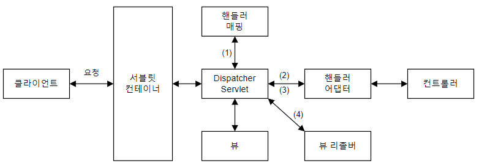
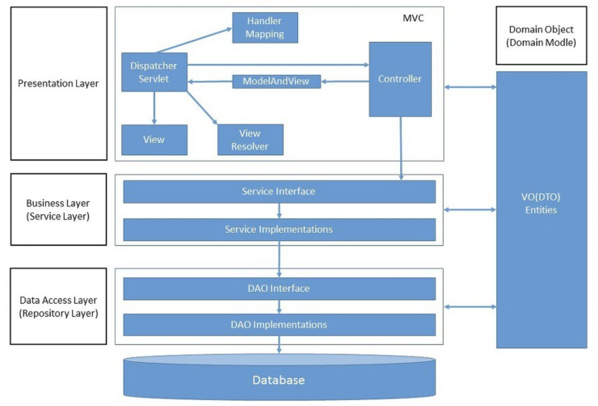

# Background Knowledge of Spring Boot

## 스프링 부트 동작 방식

`spring-boot-starter-web` 모듈을 사용하면 톰캣을 사용하는 스프링 MVC 구조 기반으로 동작한다.

서블릿(Servelet)은 클라이언트의 요청을 처리하고 결과를 반환하는 자바 웹 프로그래밍 기술이다. 서블릿은 서블릿 컨테이너에서 관리하며(ex : 서블릿 생성), 서블릿 객체는 싱글톤 패턴으로 관리된다.

스프링에서는 DispatcherServelet이 서블릿의 역할을 수행한다. 톰캣을 임베드하기 때문에 서블릿 컨테이너와 DispatcherServelet은 web.xml의 설정값을 공유한다.

DispatcherServelet으로 http request가 들어오면 핸들러 매핑을 통해 컨트롤러(핸들러)를 호출하고, 컨트롤러의 응답이 돌아오면 가공해서 반환한다. 뷰 형식으로 리턴하는 컨트롤러를 사용할 때는 뷰 리졸버를 통해 뷰를 받아 리턴한다.

## 레이어드 아키텍쳐

별도의 설정이 없으면 `spring-boot-starter-web` 하에서 아래와 같은 MVC 구조를 띈다.

## GoF 디자인 패턴

디자인 패턴의 분류법

## REST API

주고받는 자원에 이름을 붙이고 URI에 명시해 HTTP 메서드 (GET, POST, PUT, DELETE)로 주고받는 아키텍쳐

REST 아키텍쳐를 구현하는 웹 서비스를 RESTful하다고 말한다.

특징으로는 유니폼 인터페이스, Stateless, 캐시 가능성, 레이어 시스템, 클라이언트-서버 아키텍쳐가 있다.

URI는 소문자로 작성하고, 언더바 대신 하이픈을 사용한다.

## References

https://djcho.github.io/springboot/spring-boot-chapter2-2/