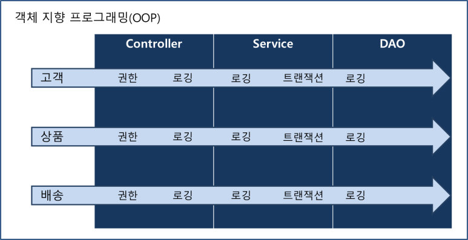
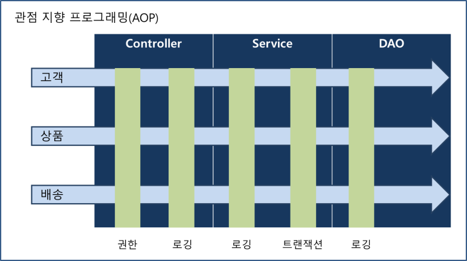

# Overview of Spring / Spring Boot

Summary of the Book '스프링 부트 핵심 가이드' (author : 장정우)

## Spring Framework

> 자바 언어를 이용해 엔터프라이즈급 개발을 편리하게 만들어주는 오픈소스 경량급 애플리케이션 프레임워크

### 특징들

#### 1. 제어역전 (IoC)

보통의 자바 개발은 객체를 선언하고 개발자가 그 객체의 이용을 제어하지만, IoC에서는 사용할 객체를 직접 생성하지 않고 객체의 생명주기를 외부에 위임한다. 외부는 스프링 컨테이너 또는 IoC 컨테이너를 의미하며, IoC를 통해 의존성 주입(DI), AOP 등이 가능해진다. 따라서 개발자는 비즈니스 로직 구현에만 집중할 수 있다.

#### 2. 의존성 주입 (DI)

사용할 객체를 직접 생성하지 않고 외부 컨테이너가 생성한 객체를 입력받아 사용한는 IoC의 한 방식.

#### 3. 관점 지향 프로그래밍 (AOP)

원래의 OOP에서 비즈니스 로직을 제외한 중복되는 부분들인 로깅, 트랜잭션 등의 로직을 모듈화해 삽입. 삽입 방식으로는 컴파일 과정에 삽입하는 방식, 바이트코드를 메모리에 로드할 때 삽입하는 방식, 프록시 패턴을 이용한 방식이 있고 스프링은 프록시 패턴을 이용한다. 

### Spring Boot와의 비교

스프링 프레임워크의 다양한 모듈들 중 필요한 것을 선택하고 의존성을 관리하는 작업을 간단하게 함. 시리즈 annotation으로 @Component 가 붙은 클래스를 발견해 bean으로 등록하는 등 자동설정이 가능. 스프링 부트 액추에이터라는 모니터링 도구가 있음.

## References

https://blog.naver.com/PostView.naver?blogId=minsuuuus&logNo=222213099940
