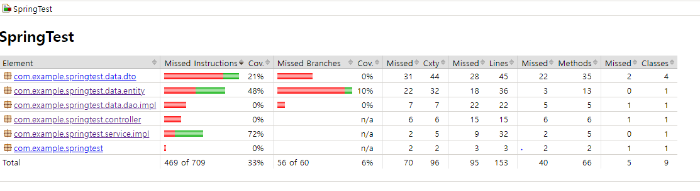

# Testing Process of Spring App

## 1. Background

TDD개발과 테스트 코드 작성은 엄연히 다르다.

### 개발 시 테스트 코드 작성의 장점
- 개발 과정에서 문제 미리 발견
- 하나의 명세 문서 역할을 함

### 단위 테스트와 통합 테스트
- 단위 테스트 : app의 개별 모듈을 각각 독립적으로 테스트
- 통합 테스트 : 여러 모듈을 함께 테스트해서 전체적 로직을 검증

### Given - When - Then 패턴
테스트 코드를 작성할 때의 코드 표현법
- given : 테스트의 환경을 설정하는 단계로, 필요한 변수를 세팅하거나 Mock 객체로 특정 상황의 행동을 정의한다.
- when : 테스트의 목적을 보여주는 단계
- then : 결과를 검증하는 단계

### FIRST 규칙
테스트 코드 작성 시 도움이 되는 규칙
- Fast
- Isolated
- Repeatable
- Self-Validating
- Timely
  - 테스트 코드를 전체 app 코드를 구현하기 전에 작성해야 함(TDD에서만)

## 2. JUnit
자바에서 사용되는 테스트 프레임워크로서 단위 테스트, 통합 테스트 기능을 제공하고 어노테이션 기반의 테스트 방식을 지원한다. 또한 Assert를 지원한다.

### gradle 설정

```gradle
testImplementation 'org.springframework.boot:spring-boot-starter-test'

tasks.named('test') {
    useJUnitPlatform()
}
```

### JUnit 생명주기

- @Test : 테스트 코드를 포함한 메소드 정의
- @BeforeAll : 테스트 시작 전 호출
- @BeforeEach : 각 테스트 메소드 시작 전에 호출
- @AfterAll : 테스트 종료 후 호출
- @AfterEach : 각 테스트 메소드 종료 후에 호출

```java
public class TestLifeCycle {
    @BeforeAll
    static void beforeAll(){
        System.out.println("## BeforeAll annotation called\n");
    }

    @Test
    void test1(){
        System.out.println("## test1 start\n");
    }
}
```

## 3. 컨트롤러 테스트 작성

단위 테스트가 아니라 @WebMvcTest를 이용한 슬라이스 테스트라고 부른다. 완전히 고립된 환경이 아니라 웹 환경과 같이 테스트되기 때문이다.

```java
@WebMvcTest(ProductController.class)
public class ProductControllerTest {
    @Autowired
    private MockMvc mockMvc;

    @MockBean
    ProductServiceImpl productService;

    @Test
    @DisplayName("createProduct test")
    void createProductTest() throws Exception{

        ProductDto productDto = new ProductDto("pen",11,111);

        given(productService.saveProduct(new ProductDto("pen",11,111))).willReturn(
                new ProductResponseDto(123L,"pen",11,111)
        );

        Gson gson = new Gson();
        String content = gson.toJson(productDto);

        mockMvc.perform(
                post("/product").content(content).contentType(MediaType.APPLICATION_JSON)
        ).andExpect(status().isOk())
                .andExpect(jsonPath("$.number").exists())
                .andExpect(jsonPath("$.name").exists())
                .andExpect(jsonPath("$.price").exists())
                .andExpect(jsonPath("$.stock").exists())
                .andDo(print());

        verify(productService).saveProduct(new ProductDto("pen",11,111));
    }
}
```
어노테이션들을 정리하면 아래와 같다.
- @WebMvcTest(테스트 대상.class) : 웹에서 사용되는 요청과 응답에 대한 테스트를 수행할 수 있다. @SpringBootTest보다 가볍게 테스트하기 위해 사용된다.
- @MockBean : 실제 빈 객체가 아닌 Mock 객체를 주입하는 역할로, 개발자가 Mockito의 given() 메서드로 동작을 정의해야 한다.
- @DisplayName : 테스트의 이름 정의

mockMvc는 컨트롤러의 API를 테스트하기 위해 모의 HTTP 서블릿을 요청하는 유틸리티 클래스이다.

verify는 지정된 메서드가 실행됐는지 검증하는 역할이다.

예제에서 코드가 given-when-then의 구조를 갖추고 있음을 확인할 수 있다.

Gson은 구글에서 개발한 JSON 파싱 라이브러리이다
`implementation("com.google.code.gson:gson")` 로 추가

## 4. 서비스 레이어 테스트코드 작성

완전히 고립된 환경의 단위 테스트 코드로 @WebMvcTest 어노테이션이 없다.

```java
public class ProductServiceTest {
    private ProductDAO productDAO = Mockito.mock(ProductDAO.class);
    private ProductServiceImpl productService;

    @BeforeEach
    public void setUpTest(){
        productService = new ProductServiceImpl(productDAO);
    }

    @Test
    void getProductTest(){
        Product givenProduct = new Product(123L,"pen",10,1);
        Mockito.when(productDAO.selectProduct(123L)).thenReturn(givenProduct);

        ProductResponseDto productResponseDto = productService.getProduct(123L);

        Assertions.assertEquals(productResponseDto.getNumber(),givenProduct.getNumber());
        Assertions.assertEquals(productResponseDto.getName(),givenProduct.getName());
        Assertions.assertEquals(productResponseDto.getPrice(),givenProduct.getPrice());
        Assertions.assertEquals(productResponseDto.getStock(),givenProduct.getStock());
        verify(productDAO).selectProduct(123L);
    }

    @Test
    void saveProductTest(){
        Mockito.when(productDAO.insertProduct(any(Product.class))).then(AdditionalAnswers.returnsFirstArg());
        ProductResponseDto productResponseDto = productService.saveProduct(
                new ProductDto("pen",10,1)
        );
        Assertions.assertEquals(productResponseDto.getName(),"pen");
        Assertions.assertEquals(productResponseDto.getPrice(),10);
        Assertions.assertEquals(productResponseDto.getStock(),1);

        verify(productDAO).insertProduct(any());
    }
}

```

위의 예제에서는 Mockito.mock으로 DAO 객체를 주입받고 BeforeEach로 테스트할 클래스인 자기 자신을 생성해준다.  
그리고 `Mockito.when().thenReturn()`으로 given 조건을 표현하고 있다.
그 후 실제 메소드 호출로 when 조건을, assert와 verify로 then 조건을 표현하고 있다.  

위의 예제와 다르게 @MockBean 어노테이션으로 Mock 객체를 주입받을 수도 있다.

```java
@ExtendWith(SpringExtension.class)
@Import({ProductServiceImpl.class})
@ContextConfiguration(classes={ProductServiceImpl.class}) // To compress intellij error "could not autowire : no Bean of ProductServiceImpl"

public class ProductServiceTest2 {
    @MockBean
    private ProductDAO productDAO;

    @Autowired
    private ProductServiceImpl productService;
    ...
}

```

위 예제에서 @ContextConfiguration은 intellij의 "could not autowire : no Bean of ProductServiceImpl"오류를 피하기 위해 넣었다.

ExtendWith은 JUnit의 스프링 테스트 컨텍스트 주입을 위해 넣음

@Autowired에서 ProductServiceImpl가 잘 들어오도록 @Import를 넣음

## 5. 리포지토리 객체의 테스트

리포지토리 객체의 테스트에 있어서는 데이터베이스 연동을 고려해야 한다.  
findById() 등의 기본 제공 메서드는 이미 검증이 되었기 때문에 테스트 의미가 없다.  
이 예제에서는 H2 DB를 테스트 DB로 사용하였다.  
`testImplementation("com.h2database:h2")`로 추가하면 된다

```java
@DataJpaTest
public class ProductRepositoryTestByH2 {
    @Autowired
    private ProductRepository productRepository;

    @Test
    void selectTest(){
        Product product = new Product();
        product.setName("pen");
        product.setPrice(1);
        product.setStock(1);

        Product savedProduct = productRepository.save(product);

        Product foundProduct = productRepository.findById(savedProduct.getNumber()).get();

        assertEquals(product.getName(),savedProduct.getName());
        assertEquals(product.getPrice(),savedProduct.getPrice());
        assertEquals(product.getStock(),savedProduct.getStock());
    }
}
```

@DataJpaTest : JPA와 관련된 설정만 로드해서 테스트를 진행, 기본 DB는 임베디드 DB 사용
@DataJpaTest로 @Autowired에서 의존성이 정상적으로 주입됨

### 기존 MariaDB를 이용해서 레포지토리 테스트하기

```java
@AutoConfigureTestDatabase(replace = AutoConfigureTestDatabase.Replace.NONE) // disable embedded H2, enabling mariaDB
```
이 어노테이션을 @DataJpaTest와 같이 사용하면 된다.

## 6. JaCoCo를 활용한 테스트 커버리지 확인

테스트 커버리지 수치를 Line, Method, Branch 등에 대해 파일/폴더 별로 보여줌

### gradle
```gradle
plugins {
    ...
    id 'jacoco'
}

tasks.named('test') {
    useJUnitPlatform()
    finalizedBy(jacocoTestReport)

    jacoco{
        enabled=true
//        excludes+=["com/example/springtest/service/impl/ProductServiceImpl"]
    }
}

jacocoTestReport{
    dependsOn(test)
    reports{
        xml.required=false
        csv.required=false
        html.outputLocation = layout.buildDirectory.dir("jacocoHtml")
    }
}

jacocoTestCoverageVerification{
    violationRules {
        rule{
            limit {
                minimum = 0.1
            }
        }

        rule{
            enabled = false
            element = 'CLASS'
            includes = ["org.gradle.*"]
            limit{
                counter = 'LINE'
                value = 'TOTALCOUNT'
                maximum = 0.3
            }
        }
    }
}

jacoco{
    toolVersion = '0.8.10'
    reportsDirectory = layout.buildDirectory.dir("reports/jacoco/test")
//    applyTo run
}

```

Rule로 커버리지가 일정 기준을 충족하지 못할 때 fail되게 할 수 있음

applyTo는 run task에 대한 dependency 가리킴

excludes를 이용해서 특정 폴더는 측정에서 제외 가능

outputLocation을 설정해서 결과 html의 위치를 변경 가능

위 예제의 경우 `build/jacocoHtml/index.html` 에 생성됨




