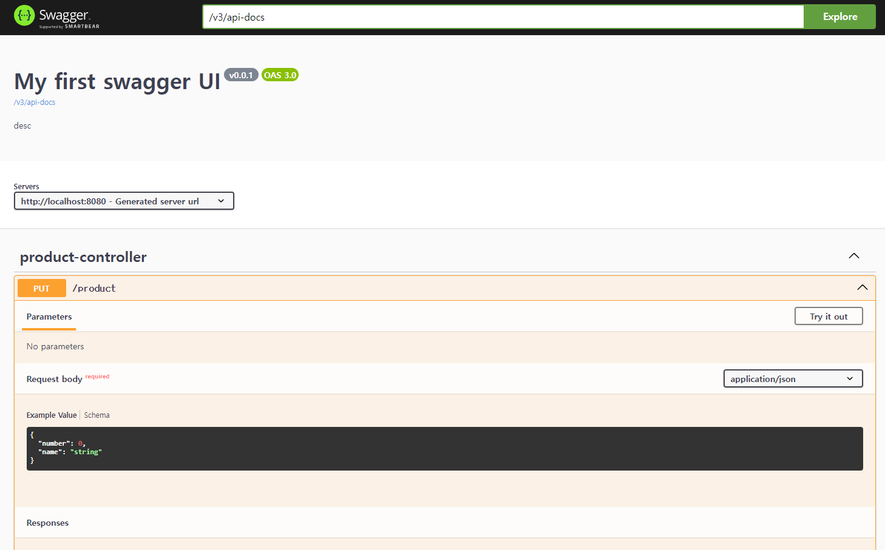

# Tools for REST API specification & logging

## Talend API
브라우저 확장 프로그램으로 쉽게 HTTP 요청을 보낼 수 있음

## Swagger - REST API Spec의 문서화

- ### gradle

`implementation "org.springdoc:springdoc-openapi-starter-webmvc-ui:2.3.0"`  
을 gradle에 추가하면 자동으로
> `http://localhost:8080/swagger-ui/index.html#/`  

에 명세 사이트가 생성됨

- ### Configuration (Optional)

configuration 패키지 하위에 아래와 같은 파일을 생성해주면 됨

```java
public class SwaggerConfiguration {
    @Bean
    public OpenAPI api(){
        return new OpenAPI().info(new Info().title("My first swagger UI")
                .description("desc")
                .version("v0.0.1")
        );
    }
}
```

- ### Add Description

아래처럼 @Parameter 를 이용해 매개변수의 설명을 추가할 수 있다.

```java
@GetMapping(value="/request")
public String getRequestParam1(
        @Parameter(description = "custom description", required = true) @RequestParam("n") String name,
        @RequestParam("e") String email
){
    return name+" "+email;
}
```
자세한 내용은 https://springdoc.org/#springdoc-openapi-core-properties 참고

- ### Execution Example

위 예시처럼 사이트 내에서 API의 테스트도 가능하다


## Logback

로그의 레벨(INFO -> WARN -> ERROR) 설정이 가능, 자체적 로그 압축 등 관리도 지원

- ### logback-spring.xml을 resources에 추가
```xml
<?xml version="1.0" encoding="UTF-8"?>
<!--<beans xmlns="http://www.springframework.org/schema/beans"-->
<!--       xmlns:xsi="http://www.w3.org/2001/XMLSchema-instance"-->
<!--       xsi:schemaLocation="http://www.springframework.org/schema/beans http://www.springframework.org/schema/beans/spring-beans.xsd">-->

<!--</beans>-->
<configuration>
    <property name="LOG_PATH" value="./logs"/>

    <!-- Appenders -->
    <appender name="console" class="ch.qos.logback.core.ConsoleAppender">
        <filter class="ch.qos.logback.classic.filter.ThresholdFilter">
            <level>INFO</level>
        </filter>
        <encoder>
            <pattern>[%d{yyyy-MM-dd HH:mm:ss.SSS}] [%-5level] [%thread] %logger %msg%n</pattern>
        </encoder>
    </appender>

<!--    <appender name="INFO_LOG" class="ch.qos.logback.core.rolling.RollingFileAppender">-->
<!--        <filter class="ch.qos.logback.classic.filter.ThresholdFilter">-->
<!--            <level>INFO</level>-->
<!--        </filter>-->
<!--        <file>${LOG_PATH}/info.log</file>-->
<!--        <append>true</append>-->
<!--        <rollingPolicy class="ch.qos.logback.core.rolling.TimeBasedFileNamingAndTriggeringPolicy">-->
<!--            <fileNamePattern>${LOG_PATH}/info_${type}.%d{yyyy-MM-dd}.gz</fileNamePattern>-->
<!--            <maxHistory>30</maxHistory>-->
<!--        </rollingPolicy>-->
<!--        <encoder>-->
<!--            <pattern>[%d{yyyy-MM-dd HH:mm:ss.SSS}] [%-5level] [%thread] %logger %msg%n</pattern>-->
<!--        </encoder>-->
<!--    </appender>-->

    <root level="INFO">
        <appender-ref ref="console"/>
<!--        <appender-ref ref="INFO_LOG"/>-->
    </root>
</configuration>
```

ConsoleAppender(콘솔 출력), FileAppender(파일에 저장) 등의 옵션 존재

- ### Gradle
`spring-boot-starter-web`에 내장되어 있어 별도 설정이 필요 없음

- ### 이용방법

```java
private final Logger LOGGER = LoggerFactory.getLogger(ProductServiceImpl.class);
Logger.info("log here");
```


