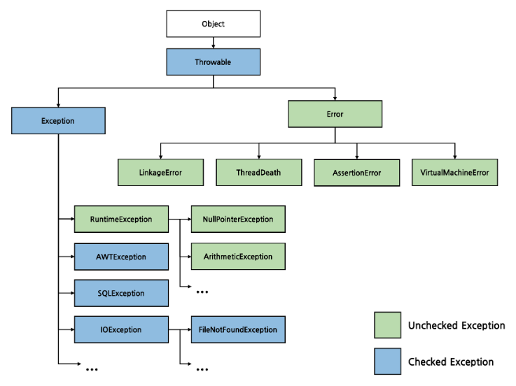

# validation and exception

## Validation

### 1. Background

자바에서 데이터 검증을 위해 Bean Validation이라는 프레임워크를 제공

Hibernate Validator는 Bean Validation 명세의 구현체로, 스프링 부트에서 유효성 검사 표준으로 채택되어 쓰이고 있다.

### 2. Setting

Gradle :
```gradle
implementation 'org.springframework.boot:spring-boot-starter-validation'
```

### 3. DTO 검증 - @Valid

```java
@Data
@NoArgsConstructor
@AllArgsConstructor
@ToString
@Builder
public class ValidRequestDto {
    @NotBlank
    String name;

    @Email
    String email;

    @Pattern(regexp="01(?:0|1|[6-9])[.-]?(\\d{3}|\\d{4})[.-]?(\\d{4})$")
    String phoneNumber;

    @Min(value=20) @Max(value=40)
    int age;
}
```

이외에도 많은 어노테이션들이 존재한다.

검증 시행은 아래와 같이 @Valid를 통해 할 수 있다.

```java
@RestController
@RequestMapping("/validation")
public class ValidationController {
    private final Logger logger = LoggerFactory.getLogger(ValidationController.class);

    @PostMapping("/valid")
    public ResponseEntity<String> checkValidationByValid(
            @Valid @RequestBody ValidRequestDto validRequestDto
            ){
        logger.info(validRequestDto.toString());
        return ResponseEntity.status(HttpStatus.OK).body(validRequestDto.toString());
    }
}
```

@Valid의 조건을 만족하지 못하면 위 컨트롤러에서 400 Http 에러를 보냄

### 4. DTO 검증 - @Validated

@Valid 대신 @Validated를 사용하면 그룹으로 검사 대상을 분류해서 그룹 별로 검사할 수 있다.

### 5. Custom Validation 추가

자바/스프링의 기본 제공 어노테이션에 없는 검증을 수행할 수 있음

ConstraintValidator와 커스텀 어노테이션의 조합으로 이루어짐

아래와 같이 Validator 클래스를 생성
```java
public class TelephoneValidator implements ConstraintValidator<Telephone, String> {
    @Override
    public boolean isValid(String value, ConstraintValidatorContext context){
        if(value==null){
            return false;
        }
        return value.matches("01(?:0|1|[6-9])[.-]?(\\d{3}|\\d{4})[.-]?(\\d{4})$");
    }
}
```

위 예제에서 ConstraintValidator<A,T> 는 어노테이션 A와 검사할 타입 T를 의미

```java
@Target(ElementType.FIELD)
@Retention(RetentionPolicy.RUNTIME)
@Constraint(validatedBy = TelephoneValidator.class)
public @interface Telephone {
    String message() default "incorrect form of telephone number!";
    Class[] groups() default {};
    Class[] payload() default {};
}
```

@Target과 @Retention은 원래 어노테이션 정의할 때 필요, 각각 어느 요소에 이 어노테이션이 붙을 수 있는지와 이 어노테이션이 유효한 생명주기를 나타냄

이렇게 @Telephone을 정의하고 나면 아래와 같이 사용이 가능하다.

```java
@Telephone
String phoneNumber;
```

## Exception

### 1. Background

예외의 상속구조는 아래 이미지에 정리되어있다.



Checked 예외는 컴파일 단계에서 확인 가능한 예외 상황이며 Unchecked는 런타임단계에서 확인되는 예외 상황을 나타낸다. 

Error는 애플리케이션 코드에서 핸들링이 거의 불가능하지만 Exception은 미리 설계한 코드로 처리할 수 있다.

### 2. 예외 처리 방법

 - 복구 - try/catch로
 - 처리 회피 - throw로 던져버림
 - 전환 - 예외 처리 로직을 위해 래핑 등 다른 예외 타입으로 전환

### 3. 스프링 부트의 예외 처리

보통 웹 앱에서는 외부 요청을 처리하다가 예외가 발생하면 이를 복구하기보다는 클라이언트에게 상황을 전달

 - @RestControllerAdvice와 @ExceptionHandler를 통해 모든 컨트롤러의 예외를 처리
 - @ExceptionHandler를 통해 특정 컨트롤러의 예외를 처리

### 4. 런타임예외 핸들러

아래 예제에서는 @RestControllerAdvice와 @ExceptionHandler를 이용

```java
@RestControllerAdvice
public class CustomExceptionHandler {
    private final Logger logger = LoggerFactory.getLogger(CustomExceptionHandler.class);

    @ExceptionHandler(value = RuntimeException.class)
    public ResponseEntity<Map<String,String>> handleException(RuntimeException e, HttpServletRequest request){
        HttpHeaders responseHeaders = new HttpHeaders();
        HttpStatus httpStatus = HttpStatus.BAD_REQUEST;

        logger.error("Advice 내 exception 호출, {}, {}|",request.getRequestURI(),e.getMessage());

        Map<String,String> map = new HashMap<>();
        map.put("error type",httpStatus.getReasonPhrase());
        map.put("code","400");
        map.put("message",e.getMessage());

        return new ResponseEntity<>(map,responseHeaders,httpStatus);
    }
}
```
이제 컨트롤러로의 요청이 런타임Exception을 일으키면 위 코드에 의해 에러메시지 응답이 생성된다.

컨트롤러 클래스에 직접 핸들러를 만들면 그 컨트롤러 관련해서는 그 핸들러가 우선됨

### 5. Custim Exception

커스텀 예외를 사용하면 예외 처리가 더 용이하고 한 곳이 처리하게 할 수 있음

구성은 Exception 클래스를 상속하는 Custom Exception 클래스, 처리를 용이하게 하기 위한 도메인 표시자, 핸들러로 구성됨

```java
public class CustomException extends Exception{
    private Constants.ExceptionClass exceptionClass;
    private HttpStatus httpStatus;

    public CustomException(Constants.ExceptionClass exceptionClass, HttpStatus httpStatus, String message){
        super(exceptionClass.toString()+message);
        this.exceptionClass = exceptionClass;
        this.httpStatus=httpStatus;
    }
}
```

커스텀 예외

```java
@ExceptionHandler(value = CustomException.class)
public ResponseEntity<Map<String,String>> handleCustomException(CustomException e, HttpServletRequest request){
    HttpHeaders responseHeaders = new HttpHeaders();

    logger.error("Advice 내 custom exception 호출, {}, {}|",request.getRequestURI(),e.getMessage());

    Map<String,String> map = new HashMap<>();
    map.put("error type",e.getHttpStatusType());
    map.put("code",Integer.toString(e.getHttpStatusCode()));
    map.put("message",e.getMessage());

    return new ResponseEntity<>(map,responseHeaders,e.getHttpStatus());
}
```

핸들러


