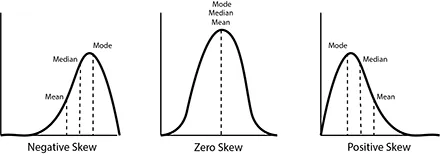

# Statistics

## Small learnings

영어 right skewed 는 몸통이 아니라 꼬리 기준이다

right skewed = positive skew

## 가설 검정

### Null hypothesis(귀무 가설)

기본적으로 참이라고 가정하는 가설

귀무 가설이 참이라 했을 때 정말 말도 안되는 일이 발생하면 귀무가설을 기각, 대립가설(alternative hypothesis)을 채택

p value는 귀무 가설이 참일 때 어떤 사건이 일어날 확률

p value가 작은 값인 알파보다도 더 작으면 정말 말도 안되는 확률이므로 귀무 가설을 기각

### 용어 주의

p value가 알파보다 클 때 대립가설을 기각하는 것일 뿐, 귀무가설을 참으로 받아들이는 것은 아님

따라서 귀무가설을 <u>**accept**</u> 한다고 표현하는 것은 조금 부적절한 듯

